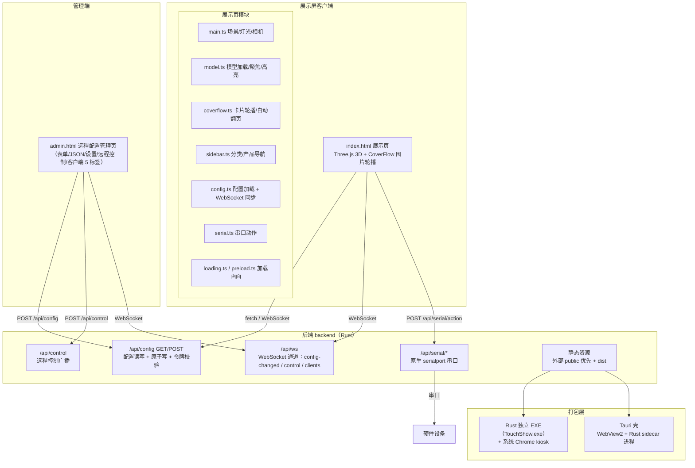

# TouchShow

TouchShow 是一个基于 Vite、TypeScript 和 Three.js 的触控展览展示系统，面向展厅触摸屏和局域网管理场景。

## 功能

- 加载并展示 FBX、GLB、GLTF 三维模型，支持拖拽旋转、缩放和产品部件聚焦。
- 图片模式使用 CoverFlow 展示产品，支持触摸滑动、拖拽、滚轮、点击和空闲自动翻页。
- 3D 模型模式隐藏 CoverFlow，点击产品后高亮对应模型物体并显示产品信息。
- 统一的科技蓝毛玻璃质感界面（单一默认主题，无主题切换）。
- 通过 `/admin` 远程编辑 `public/config.json`、远程切换产品/侧边栏；展示屏与服务器经 **WebSocket（`/api/ws`）双向实时同步**（断线指数退避重连 + 5s 轮询兜底）。
- 管理页「资源上传」：产品图片 / 3D 模型在浏览器中直接上传到 `public/`，可选自动绑定到产品并实时推送展示屏。
- 可选串口联动：切换产品时将 `action` 按模板发送到配置的串口。
- 支持浏览器开发模式、单文件 EXE 和 Tauri 桌面包。

## 环境

- Node.js `24.19.0`
- Windows 开发需要 Rust、Tauri 依赖和 MSVC Build Tools。
- Linux Tauri 包必须在 Linux 构建机上生成，并需要 `webkit2gtk-4.1` 等系统依赖。

## 开始使用

```bash
npm install
npm run dev
```

`npm run dev` 会先编译 Rust 后端（`cargo build`，首次较慢），再同时启动 Rust 服务（backend/）和 Vite。展示页地址为 `http://localhost:5173/`，管理页地址为 `http://localhost:3000/admin`。也可以分开启动：

```bash
npm run dev:server   # Rust 后端服务（3000）
npx vite             # Vite 前端开发服务器（5173）
```

开发服务器会将 `/api` 代理到 Rust 后端服务的 `3000` 端口。

## 配置

运行时资源位于 `public/`，模型放在 `public/Models/`，产品图片放在 `public/products/`。主配置文件为 `public/config.json`：

```json
{
  "model": "C919.glb",
  "displayMode": "image",
  "category": [],
  "serial": {
    "enabled": false,
    "port": "COM3",
    "baudRate": 9600,
    "dataBits": 8,
    "stopBits": 1,
    "parity": "none",
    "template": "{action}\\r\\n"
  }
}
```

产品可选字段：

- `object`：3D 模型中的物体名称，3D 模式下用于高亮。
- `rotate`：聚焦产品前模型绕 Y 轴旋转的角度，单位为度。

分类可选字段：

- `dir`：分类资源目录名（产品图片存放于 `public/products/<dir>/`）。缺省回退分类名称 `label`；分类名含特殊字符时建议显式设置仅含字母/数字/中文的目录名。管理页「分类与产品」可编辑，「资源上传」上传图片与产品表单的图片快选均使用该目录。

管理令牌通过环境变量 `ADMIN_TOKEN` 设置。未设置时使用开发默认令牌（服务启动 banner 会醒目告警）；显式设置为空 = 开放模式；生产环境应显式设置自定义令牌。

## 远程控制

管理页 `/admin` 的「远程控制」标签页可操作展示屏幕，立即生效，不写入 `public/config.json`。页顶「目标屏幕」可选**全部展示屏（广播）**或**指定单台屏**（仅该屏响应）：

- 切换分类/产品：点击分类名仅切换该分类（展开分类并展示内容，不选中具体产品）；点击产品按钮切换并选中该分类下的具体产品。
- 侧边栏菜单：显示/隐藏按钮控制展示屏幕右侧的产品侧边栏。
- 目标下拉实时列出在线展示屏（仅显示名称/IP，展示内容见「客户端」页），选择单台屏即定向控制。

操作由管理页调用 `POST /api/control`，经 WebSocket 实时通道（展示屏连接 `/api/ws` 收 `control` 消息）分发；请求体可带可选 `targetClientId` 定向到某台屏（缺省 = 广播所有屏）。示例：

```json
{ "action": "category", "category": 0 }
{ "action": "product", "category": 0, "product": 1 }
{ "action": "product", "category": 0, "product": 1, "targetClientId": "屏A 的客户端 id" }
{ "action": "sidebar", "visible": false }
```

字段说明：

- `action`：`category` 仅切换分类；`product` 切换并选中产品；`sidebar` 显示（`visible: true`）或隐藏（`visible: false`）侧边栏。
- `category`：分类下标（`config.json` 中 `category` 数组索引，`sidebar` 命令忽略）。
- `product`：产品下标（`action` 为 `product` 时有效）。
- `targetClientId`（可选）：在线展示屏的客户端 id（「目标屏幕」下拉提供）；缺省为广播所有屏，提供则仅该屏响应（目标离线返回 404）。

该接口与配置保存一样受 `ADMIN_TOKEN` 保护。

### 客户端在线状态（实时通道）

所有展示屏与管理页通过 WebSocket（`/api/ws`）与本服务器保持双向连接，服务端每 30s 心跳判活（无响应判断线）：

- 管理页「客户端」标签实时显示在线连接：类型（展示屏/管理页）、来源 IP、连接时长、UA；每台展示屏还显示其**当前展示的分类/产品**（屏内切换或远程控制后自动上报，未选择时显示「（未展示）」），连接/断开即时更新。IP 为**连接来源地址**（屏经局域网 IP 访问即显示其自身 IP；本机/一体机经 localhost 访问时回退显示该机局域网 IPv4，列表不出现 127.0.0.1）。
- 展示屏可用 URL 参数命名便于区分：`http://<host>/?name=屏A`（未命名则列表仅显示 IP）。
- 展示屏向服务器上报 `screen-status`（当前分类/产品）；服务器广播三类消息：`config-changed`（配置保存/外部改文件）、`control`（远程控制，可定向单屏）、`clients`（连接列表变化，含各屏当前展示）。

## 构建与打包

```bash
npm run build
npm run package
npm run package:tauri
npm run package:tauri:linux
npm run make-icon
```

- `npm run build`：生成前端文件到 `dist/`。
- `npm run package`：生成 `release/TouchShow.exe` 和外部 `release/public/`（dist 在编译期内嵌进 exe）。
- `npm run package:tauri`：生成 Windows Tauri 安装包。
- `npm run package:tauri:linux`：在 Linux 构建机生成 Linux Tauri 包。
- `npm run make-icon`：根据 `src/assets/logo.png` 生成 Tauri 应用图标。

`dist/`、`release/` 和 `src-tauri/target/` 都是生成目录，不要手动编辑。**前端产物 `dist/` 在 `cargo build` 时内嵌进后端可执行文件（编译期固化，发布形态不对外暴露、不可被修改）**；修改 `public/` 后，EXE 或 Tauri 包需要重新打包才能同步资源。

## 项目结构

```text
index.html            展示页入口
admin.html            远程配置管理页（脚本入口 src/admin/adminMain.ts）
404.html              404 页面
backend/              Rust 后端服务（axum + tokio）：静态服务 / 配置 API / WebSocket 实时通道 / 远程控制 / 原生 serialport 串口
backend/src/main.rs   Rust 服务入口（端口、目录解析、浏览器全屏启动）
backend/src/live.rs   WebSocket 通道（/api/ws：config-changed/control/clients + 30s 心跳）
backend/src/serial.rs 串口桥接（原生 serialport crate 实现 /api/serial/*）
backend/src/web.rs    静态资源服务（外部 public 优先 → dist）与 404
vite.config.ts        Vite 开发与多页面构建配置
src/admin/adminMain.ts  管理页脚本（由 admin.html 内联脚本迁出）
src/main.ts           Three.js 场景和应用初始化
src/model.ts          模型加载、聚焦和复位
src/coverflow.ts      产品 CoverFlow
src/sidebar.ts        分类和产品导航
src/config.ts         配置加载与实时同步
src/uiStore.ts        UI 状态容器（CoverFlow↔侧边栏选中同步）
src/serial.ts         串口动作发送
src/loading.ts        加载画面和资源预加载入口
public/                模型、产品图片、配置和页面公共资源
scripts/               EXE、Tauri 和图标打包脚本
```

## 检查

```bash
npx tsc --noEmit
npm run build
npm test
```

`npm test` 以后端**黑盒行为基线**测试（`node --test`）：以隔离的临时 `public` 启动真实 Rust 服务二进制（`backend/target/debug/touchshow-server`），验证静态页/配置 API/鉴权/远程控制/模型/本机 IP/串口/WebSocket 实时通道（含客户端列表）。`npm test` 的 `pretest` 会自动先编译 Rust 服务（`cargo build`），静态页面来自 `dist/`（需先 `npm run build`），测试不会污染真实 `public/config.json`。

## 许可

本项目为内部使用项目。

---

## 架构分析

> 本节为项目架构与改进建议的存档。实时通道已于 2026-09-02 由 SSE（/api/config/events）整体迁移为 WebSocket（/api/ws）；**后端已于 2026-09-03 由 Node（server.cjs）整体迁移为 Rust（backend/，axum + tokio + 原生 serialport）**，下文相关描述按当前实现更新。

### 总体架构

TouchShow 是「浏览器前端 + Rust 后端 + 多种打包形态」的分层结构，前后端同源部署：



**核心数据流：**

1. **配置变更**：管理页 `POST /api/config` → 写 `config.json` → 广播 `config-changed` → 各展示屏 `refresh()` 拉取 → `onConfigChange()` 驱动侧边栏/CoverFlow/模型重建
2. **远程控制**（不落盘）：管理页 `POST /api/control` → WebSocket 广播 `control` 消息 → 各屏 `sidebar.remoteSelect()` 执行切换
3. **串口联动**：展示屏切换产品 → `POST /api/serial/action` → Rust 后端按模板组包 → 原生 serialport 写串口
4. **实时同步**：WebSocket（`/api/ws`）为主通道，5s 轮询 + `visibilitychange` 刷新为兜底，断线指数退避重连；管理页「客户端」页实时展示在线连接列表

### 各层详解

**1. 前端展示层（`src/`，约 2300 行 TS）**

| 模块                                                                                        | 职责                                                                                  | 关键设计                                                                                                             |
| ------------------------------------------------------------------------------------------- | ------------------------------------------------------------------------------------- | -------------------------------------------------------------------------------------------------------------------- |
| `main.ts`                                                                                   | 3D 场景初始化：相机、渲染器、5 盏灯光、OrbitControls；资源预加载编排；动画循环        | 强调色（科技蓝 #00d4ff）驱动平行光；`LOADING_MIN_MS=5000` 保证加载画面最短展示；`displayMode` 决定是否创建 CoverFlow |
| `model.ts`                                                                                  | 模型管理器：FBX/GLB/GLTF 加载、材质克隆（解决共享材质高亮串扰）、聚焦/复位动画        | 帧率无关的 lerp（`alpha = 1-(1-speed)^(dt*60)`）；聚焦距离按物体包围盒自适应；加载序号防并发竞态                     |
| `coverflow.ts`                                                                              | 3D 卡片轮播：无限循环、自动翻页、拖拽/滚轮/点击                                       | `productCount===1/2/≥3` 三条特殊分支（双产品用 4 卡布局）；回绕点透明度渐隐；60s 空闲→10s 步进自动翻页               |
| `sidebar.ts`                                                                                | 一级分类 + 二级产品菜单；远程配置重建；远程控制分派                                   | GSAP 交错动画；`suppressProductSync`/`pendingRemote` 等命令式协调标志；模块级事件订阅                                |
| `config.ts`                                                                                 | 配置类型定义、加载（`/api/config`→`/config.json` 降级）、WebSocket+轮询同步、订阅分发 | 单一事实来源 `current`；快照去重；指数退避重连                                                                       |
| `serial.ts` / `productPanel.ts` / `loading.ts` / `preload.ts` / `logo.ts` / `titleLabel.ts` | 串口发送、产品信息框、加载画面、资源预加载、Logo、标题                                | 各为独立小模块                                                                                                       |

架构特点：无 UI 框架，纯 DOM + GSAP 动画；模块间通过**回调订阅**（`onConfigChange`/`onActiveProductChange`/`onRemoteControl`）解耦。

**2. 管理页（`admin.html` + `src/admin/adminMain.ts`）**

六个标签页：**分类与产品**（表单）、**JSON 模式**（编辑器+语法校验）、**设置**（展示模式/串口）、**资源上传**（产品图片 / 3D 模型上传，可选自动绑定产品）、**远程控制**（按分类分组的按钮矩阵）、**客户端**（在线连接列表）。与展示页共用 Rust 后端（backend/）的 API 和 WebSocket 通道。

特点：

- 原 1468 行单文件内联脚本已于 2026-09-02 整体迁出为 Vite 模块入口 `src/admin/adminMain.ts`（模型物体枚举 + 管理逻辑合并，构建后仍是单文件 `dist/admin.html`）
- `editing` 标志 + 全局 `input/change` 监听实现"未保存"跟踪，实时推送时跳过覆盖（避免覆盖表单）
- 管理页经 WebSocket（`role=admin`）订阅 `config-changed` / `clients`，展示屏经 `role=screen` 订阅 `config-changed` / `control`；`?name=屏A` 命名屏用于客户端列表区分
- 令牌存 `localStorage`，保存时带 `x-admin-token` 头

**3. 后端服务（`backend/`，Rust）**

`backend/`（axum + tokio）承载静态服务、配置 API、WebSocket 实时通道、远程控制、串口与浏览器启动，替代原 Node `server.cjs` + `lib/*.cjs`：

- **静态服务**（`web.rs`）：外部 `public/` 优先，其次 `dist/`（默认编译期内嵌，不可外部修改；设 `TOUCHSHOW_DIST` 或编译时未内嵌时读外部目录）；`/admin` 别名 → `dist/admin.html`；未知路径返回 404 页
- **配置 API**（`config.rs`/`api.rs`）：`GET/POST /api/config`（原子写 tmp+rename + 直接写降级）、1s 轮询监听外部直接改 `config.json`（mtime）
- **实时通道**（`live.rs`）：WebSocket `/api/ws`，广播 `config-changed` / `control` / `clients`，服务端 30s 心跳判活
- **远程控制**：`POST /api/control`（广播或 `targetClientId` 定向）
- **串口桥接**（`serial.rs`）：原生 `serialport` crate 直写串口（无 PowerShell/无 Node），按 `serial.template` 组包，支持 `\xHH` 十六进制模式；同款 `build_serial_message` 纯函数已补 Rust 单元测试
- **辅助**：`/api/models`、`/api/files`（列目录资源）、`POST /api/upload`（图片/模型上传，需令牌，扩展名白名单 + 防目录穿越 + 原子写 + 成功后广播 `config-changed`）、`/api/local-ip`、`/admin`、404 兜底、启动自动全屏开浏览器

**4. 打包层（两套并存）**

- **Rust 独立 EXE**：`npm run package` → `release/TouchShow.exe`（**dist 已内嵌于 exe**）+ 外部 `release/public/`（资源可改）；双击即启动本地服务并全屏打开系统 Chrome
- **Tauri 壳**：`npm run package:tauri` → WebView2 窗口，启动时拉起 Rust sidecar（`TouchShow-server.exe-<triple>.exe`，即同一 Rust 服务、dist 内嵌），`TOUCHSHOW_NO_OPEN=1` 隐藏控制台，轮询 3000 就绪后导航
- 关键取舍：`public/` 不打包进可执行文件 → 展陈内容可现场替换而无需重打包；`dist/` 编译期内嵌 → 代码不可被修改

### 架构优点

1. **分层清晰**：展示 / 管理 / 服务 / 打包四层边界明确，前后端通过 REST + WebSocket 解耦
2. **资源与代码分离**：`public/` 内容可热替换，运营人员改图换模型无需重新编译
3. **降级设计完善**：`/api/config` 不可用退回静态文件；WebSocket 断线有 5s 轮询兜底 + 指数退避；配置写入有原子写（tmp+rename）+ 直接写降级；串口原生直连（无外部进程依赖）
4. **务实的环境适配**：串口用原生 `serialport`（无需 Node/PowerShell）、后端 Rust 单文件自包含、配置外部改动靠 1s 轮询兜底（无 fs.watch 句柄）
5. **模块解耦良好**：`config.ts` 作为事件总线式订阅中心，各 UI 模块不互相 import 也能联动
6. **性能细节到位**：帧率无关动画、聚焦参数一次性计算避免卡顿、材质克隆、模型 dispose 防泄漏、three 独立 chunk 缓存

### 改进建议（按优先级）

**🟡 一般优化（可选）**

1. **缺失的展厅常用能力（可选）**：配置**版本历史/回滚**；定时播放/开关机计划；多屏分组与按屏控制。更彻底的令牌方案：首次启动生成随机令牌并写入配置。

**✅ 已解决（2026-09-02 / 09-03 落地）**

- Node 后端整体迁移为 Rust（`backend/`，axum 模块化 + 原生 serialport 串口），`server.cjs` / `lib/*.cjs` 已移除
- `admin.html` 内联脚本迁出为 `src/admin/adminMain.ts`；`coverflow.ts` 类型统一从 `config.ts` 导入；配置加载失败提示 + 整页重试
- 自动化测试：后端黑盒基线（`test/*.mjs`）+ Rust 串口组包单测（`cargo test`）
- SSE 实时通道迁移为 WebSocket（`/api/ws`）+ 管理页「客户端」在线状态
- `src-tauri/` 已纳入版本控制（`.gitignore` 仅忽略 `target/` 与 `binaries/`）
- `copilot-instructions.md` 已纳入版本控制：`.gitignore` 由整体忽略 `.github/` 收窄为仅忽略 `.github/prompts/`（175 个无关第三方模板不入库），项目协作规范随仓库共享（克隆即得）
- **串口管理端点鉴权**：`/api/serial/connect|disconnect|send` 增加管理令牌校验（与 `/api/config`、`/api/control` 一致，统一走 `check_auth`）；`/api/serial/action` 由展示屏运行时调用、`status/ports` 只读，保持开放。管理页对应请求自动携带 `x-admin-token`；黑盒测试新增 4 例（23/23 绿）
- **前端状态协调收敛**：新增轻量状态容器 `src/uiStore.ts` 作为 CoverFlow 中央产品的唯一事实源——取代单槽回调 `productChangeListener` 与 `suppressProductSync` 标志（CoverFlow 重建/隐藏时初始定位 silent 落库，仅真实切换才通知侧边栏）；远程控制命令队列化、侧边栏就绪后按序补执行；一级/二级点击、远程控制、配置恢复统一走 `activateCategory` / `activateProduct` 过渡路径（消除重复实现）。tsc + build + image/model 双模式浏览器实测通过
- **默认管理令牌启动告警**：`ADMIN_TOKEN` 未显式设置时，服务启动 banner 以醒目多行警告提示“正在使用默认管理令牌 11223344”及自定义方法；显式设置为空 = 开放模式、设置自定义令牌 = 正常保护，banner 分别给出对应状态行（不回显令牌值）。黑盒测试新增 3 例（26/26 绿）
- **资源上传（2026-09-03 落地）**：管理页新增「资源上传」标签页——产品图片上传到分类的**目录名称**目录（新增分类可选字段 `dir`，`public/products/<dir>/`，缺省回退 `label`；产品表单可从目录快选图片；可选自动绑定到所选产品并保存推送）、3D 模型上传到 `public/Models/`。后端 `POST /api/upload`（multipart，需管理令牌；扩展名白名单、防目录穿越、原子写 tmp+rename 同名覆盖、成功后广播 `config-changed`）与 `GET /api/files`（列目录资源）；`/products/`、`/Models/` 静态响应加 `Cache-Control: no-cache`，同名替换即时生效。黑盒测试新增 4 例（30/30 绿）

### 结论

TouchShow 工程取舍务实、没有过度设计，把「局域网配置同步」「可热替换资源」「Rust/Tauri 双打包」「串口桥接」等展厅真实痛点处理得很扎实。后端已于 2026-09-03 由 Node 整体迁移为 Rust（`backend/`，黑盒测试 30/30 全绿）；此前巨型单文件拆分（`server.cjs`/`admin.html`）、自动化测试、默认管理令牌启动告警与资源上传也已落地。剩余待办均为可选项（配置版本历史、定时播放等，详见上文「改进建议」）。
